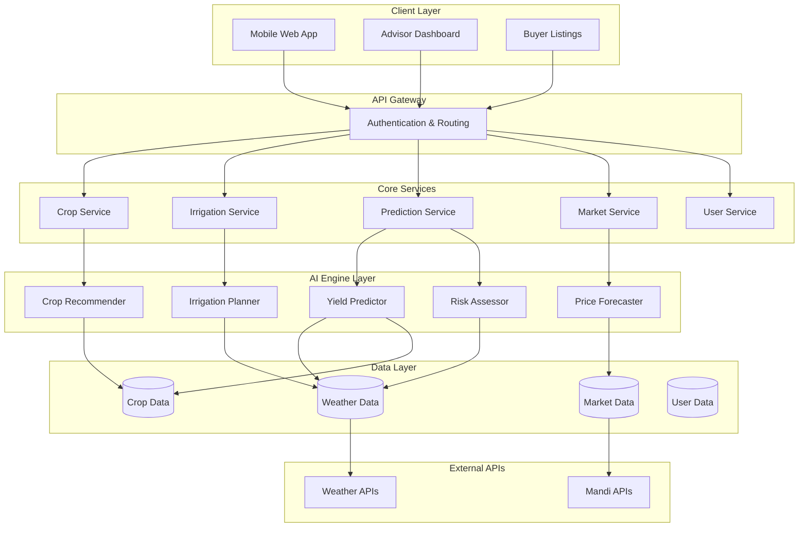

# Design Document: SmartKisan360

## Overview

SmartKisan360 is an AI-powered farmer intelligence platform that provides end-to-end agricultural guidance through four core modules: Plan, Grow, Predict, and Sell. The system leverages machine learning models for crop recommendations, irrigation optimization, yield prediction, and price forecasting while maintaining transparency, safety, and accessibility for farmers with varying technical literacy levels.

The platform follows a microservices architecture with dedicated AI engines for each domain, unified through a mobile-first web interface that works effectively on low-bandwidth connections. All recommendations include confidence levels and uncertainty bounds to ensure responsible AI deployment in agricultural contexts.

## Architecture

### System Architecture



### Technology Stack

**Frontend:**
- Progressive Web App (PWA) using React/Vue.js
- Responsive design optimized for mobile devices
- Offline capability for core features
- Multi-language support with simple UI patterns

**Backend:**
- Node.js/Python FastAPI microservices
- RESTful APIs with GraphQL for complex queries
- JWT-based authentication with minimal data collection
- Redis for caching and session management

**AI/ML Stack:**
- Python-based ML services using scikit-learn, TensorFlow/PyTorch
- Time-series forecasting with ARIMA, LSTM, and ensemble methods
- Model serving through TensorFlow Serving or MLflow
- Feature stores for consistent data preprocessing

**Data Storage:**
- PostgreSQL for structured data (users, crops, markets)
- InfluxDB for time-series data (weather, prices)
- Redis for real-time caching
- Object storage for model artifacts and static assets

**Infrastructure:**
- Containerized deployment with Docker
- Kubernetes orchestration for scalability
- CI/CD pipeline with automated testing
- Monitoring with Prometheus and Grafana

## Components and Interfaces

### 1. Crop Recommendation Engine

**Purpose:** Generate AI-powered crop suggestions based on location, season, and soil conditions.

**Core Algorithm:** Ensemble model combining:
- Random Forest for feature importance ranking
- XGBoost for non-linear pattern recognition
- Historical yield correlation analysis
- Climate suitability scoring

**Input Interface:**
```typescript
interface CropRecommendationRequest {
  district: string;
  tehsil?: string;
  soilType: 'sandy' | 'loamy' | 'clay' | 'unknown';
  season: 'kharif' | 'rabi' | 'zaid';
  farmSize: number; // in acres
  irrigationAccess: boolean;
  previousCrop?: string;
}
```

**Output Interface:**
```typescript
interface CropRecommendation {
  crop: string;
  confidence: number; // 0-1
  expectedYield: {
    min: number;
    max: number;
    unit: string;
  };
  sowingWindow: {
    start: Date;
    end: Date;
  };
  reasoning: string[];
  limitations: string[];
}
```

### 2. Irrigation Planning System

**Purpose:** Optimize water usage through AI-driven irrigation scheduling based on weather forecasts and crop requirements.

**Core Algorithm:** Multi-factor optimization using:
- Evapotranspiration (ET0) prediction using Penman-Monteith equation
- Soil moisture modeling with water balance equations
- Weather forecast integration (7-14 day horizon)
- Crop coefficient adjustments by growth stage

**Input Interface:**
```typescript
interface IrrigationPlanRequest {
  crop: string;
  plantingDate: Date;
  currentGrowthStage: string;
  soilType: string;
  location: GeoLocation;
  irrigationMethod: 'flood' | 'drip' | 'sprinkler';
}
```

**Output Interface:**
```typescript
interface IrrigationPlan {
  weeklySchedule: IrrigationEvent[];
  waterSavingsEstimate: {
    litersPerWeek: number;
    percentageSaving: number;
  };
  confidence: number;
  nextUpdateDate: Date;
  riskFactors: string[];
}

interface IrrigationEvent {
  date: Date;
  duration: number; // minutes
  waterAmount: number; // liters
  reasoning: string;
}
```

### 3. Yield Prediction and Risk Assessment

**Purpose:** Forecast crop yields and identify agricultural risks using time-series analysis and weather pattern recognition.

**Core Algorithm:** Hybrid approach combining:
- LSTM networks for temporal pattern recognition
- CNN for spatial weather pattern analysis
- ARIMA models for seasonal trend decomposition
- Ensemble voting for final predictions

**Input Interface:**
```typescript
interface YieldPredictionRequest {
  crop: string;
  plantingDate: Date;
  location: GeoLocation;
  farmingPractices: {
    irrigationType: string;
    fertilizer: boolean;
    organicMethods: boolean;
  };
  currentWeatherConditions: WeatherSnapshot;
}
```

**Output Interface:**
```typescript
interface YieldPrediction {
  expectedYield: {
    value: number;
    unit: string;
    confidenceInterval: [number, number];
  };
  riskAssessment: RiskAlert[];
  harvestWindow: {
    earliest: Date;
    optimal: Date;
    latest: Date;
  };
  modelConfidence: number;
}

interface RiskAlert {
  type: 'heat_stress' | 'drought' | 'heavy_rain' | 'disease_risk';
  severity: 'low' | 'medium' | 'high';
  timeframe: string;
  recommendations: string[];
  confidence: number;
}
```

### 4. Price Forecasting and Market Intelligence

**Purpose:** Predict crop prices and recommend optimal selling strategies using time-series forecasting and market analysis.

**Core Algorithm:** Multi-model ensemble including:
- ARIMA for seasonal price patterns
- LSTM for complex temporal dependencies
- External factor integration (festival seasons, government policies)
- Volatility modeling with confidence bands

**Input Interface:**
```typescript
interface PriceForecastRequest {
  crop: string;
  quantity: number;
  harvestDate: Date;
  preferredMandis: string[];
  qualityGrade: 'premium' | 'standard' | 'below_standard';
}
```

**Output Interface:**
```typescript
interface PriceForecast {
  priceProjection: {
    currentPrice: number;
    forecastedPrices: PricePoint[];
    currency: string;
  };
  optimalSellingWindow: {
    start: Date;
    end: Date;
    expectedPrice: number;
  };
  recommendedMandis: MandiRecommendation[];
  marketVolatility: number;
  confidence: number;
}

interface MandiRecommendation {
  name: string;
  distance: number;
  averagePrice: number;
  reliability: number;
  transportCost: number;
}
```

### 5. User Management and Multi-Tenant Support

**Purpose:** Handle different user types (farmers, advisors, buyers) with appropriate access controls and data privacy.

**User Roles:**
- **Farmer:** Primary user with crop management and selling features
- **Advisor/FPO:** Dashboard view of multiple farmers with aggregated insights
- **Buyer:** Access to produce listings and supply forecasts

**Data Privacy Implementation:**
- District-level location storage only
- Encrypted personal identifiers
- Opt-in data sharing for advisors
- Automatic data retention policies

## Data Models

### Core Entities

```typescript
// User Management
interface User {
  id: string;
  phone: string; // Primary identifier
  role: 'farmer' | 'advisor' | 'buyer';
  district: string;
  tehsil?: string;
  language: string;
  createdAt: Date;
  lastActive: Date;
}

interface Farm {
  id: string;
  farmerId: string;
  size: number; // acres
  soilType: string;
  irrigationAccess: boolean;
  location: {
    district: string;
    tehsil: string;
  };
}

// Crop Management
interface CropCycle {
  id: string;
  farmId: string;
  crop: string;
  variety?: string;
  plantingDate: Date;
  expectedHarvestDate: Date;
  actualHarvestDate?: Date;
  season: string;
  status: 'planned' | 'planted' | 'growing' | 'harvested';
}

// Market Data
interface MarketPrice {
  id: string;
  crop: string;
  mandi: string;
  district: string;
  price: number;
  unit: string;
  date: Date;
  quality: string;
  source: string;
}

// Weather Data
interface WeatherData {
  location: string;
  date: Date;
  temperature: {
    min: number;
    max: number;
    avg: number;
  };
  humidity: number;
  rainfall: number;
  windSpeed: number;
  solarRadiation?: number;
}

// AI Model Outputs
interface Prediction {
  id: string;
  userId: string;
  type: 'crop_recommendation' | 'yield_prediction' | 'price_forecast' | 'irrigation_plan';
  input: any;
  output: any;
  confidence: number;
  modelVersion: string;
  createdAt: Date;
  feedback?: {
    accuracy: number;
    userRating: number;
    comments: string;
  };
}
```

### Data Integration Strategy

**Weather Data Sources:**
- Primary: OpenWeatherMap API for current and 5-day forecasts
- Secondary: India Meteorological Department (IMD) public datasets
- Fallback: Synthetic weather patterns based on historical averages

**Market Price Sources:**
- Primary: Agmarknet (Government of India) public API
- Secondary: State agricultural marketing board websites
- Fallback: Synthetic price data with seasonal patterns

**Crop and Agricultural Data:**
- ICAR (Indian Council of Agricultural Research) public datasets
- State agriculture department recommendations
- Synthetic crop calendars and yield benchmarks

## Error Handling

### AI Model Error Handling

**Confidence Thresholds:**
- High confidence (>0.8): Display predictions with standard disclaimers
- Medium confidence (0.5-0.8): Display with enhanced uncertainty warnings
- Low confidence (<0.5): Recommend consulting local experts, provide fallback guidance

**Data Quality Checks:**
- Weather data freshness validation (reject data older than 24 hours)
- Price data anomaly detection (flag prices >2 standard deviations from mean)
- Input validation with user-friendly error messages

**Graceful Degradation:**
- When AI models fail: Provide rule-based fallback recommendations
- When external APIs fail: Use cached data with staleness indicators
- When user input is incomplete: Request minimum required information, proceed with defaults

### User Experience Error Handling

**Network Connectivity:**
- Offline mode for previously loaded recommendations
- Progressive loading with skeleton screens
- Retry mechanisms with exponential backoff

**Input Validation:**
- Real-time validation with helpful suggestions
- Auto-correction for common location name variations
- Clear error messages in user's preferred language

**Safety Mechanisms:**
- Never provide specific pesticide or chemical recommendations
- Always include "consult local expert" disclaimers
- Flag recommendations that seem unrealistic (e.g., impossible yields)

## Testing Strategy

The testing strategy employs a dual approach combining unit tests for specific scenarios and property-based tests for comprehensive validation of AI model behaviors and system correctness.

**Unit Testing Focus:**
- API endpoint validation with mock data
- Database operations and data integrity
- User interface components and interactions
- Integration between services
- Error handling and edge cases
- Authentication and authorization flows

**Property-Based Testing Focus:**
- AI model consistency and reliability across input ranges
- Data transformation and aggregation correctness
- Time-series forecasting properties
- Price prediction bounds and confidence intervals
- Irrigation optimization constraints

**Testing Infrastructure:**
- Jest/Pytest for unit and integration tests
- Property-based testing using Hypothesis (Python) or fast-check (JavaScript)
- Load testing with realistic agricultural data patterns
- End-to-end testing with Playwright/Cypress
- AI model validation with holdout datasets and cross-validation

**Continuous Testing:**
- Automated testing pipeline on every commit
- Model performance monitoring in production
- A/B testing for recommendation algorithms
- User feedback integration for model improvement
- Seasonal testing with historical weather patterns

**Test Data Management:**
- Synthetic datasets for development and testing
- Anonymized production data for model validation
- Seasonal test scenarios covering different crop cycles
- Edge case datasets (extreme weather, price volatility)
- Multi-language test cases for internationalization

## Correctness Properties

*A property is a characteristic or behavior that should hold true across all valid executions of a system—essentially, a formal statement about what the system should do. Properties serve as the bridge between human-readable specifications and machine-verifiable correctness guarantees.*

### Property 1: Crop Recommendation Completeness and Validity
*For any* valid district and season combination, the Crop_Recommender should return exactly 3 crop suggestions, each with confidence scores between 0 and 1, valid sowing date ranges (start ≤ end), and yield ranges where minimum ≤ maximum.
**Validates: Requirements 1.1, 1.2, 1.3**

### Property 2: Location-Specific Recommendation Differentiation  
*For any* two different districts with the same season, the crop recommendations should differ in at least one aspect (crop selection, timing, or yield estimates), demonstrating location-specific processing.
**Validates: Requirements 1.4**

### Property 3: Soil Type Impact on Recommendations
*For any* location and season, providing soil type information should produce different recommendations than omitting it, when soil compatibility varies between crops.
**Validates: Requirements 1.5**

### Property 4: Irrigation Schedule Structure and Water Conservation
*For any* valid crop and growth stage combination, the irrigation planner should generate a weekly schedule with positive water savings estimates compared to baseline methods, and all irrigation events should have positive duration and water amounts.
**Validates: Requirements 2.1, 2.3**

### Property 5: Weather-Responsive Irrigation Planning
*For any* crop and location, significantly different weather forecasts (e.g., high vs. low rainfall probability) should produce measurably different irrigation recommendations, demonstrating weather integration.
**Validates: Requirements 2.2, 2.4**

### Property 6: Water Scarcity Conservation Response
*For any* irrigation plan, when water scarcity conditions are detected, the updated plan should recommend equal or less water usage than the original plan.
**Validates: Requirements 2.5**

### Property 7: Yield Prediction Confidence and Risk Detection
*For any* valid crop and location data, yield predictions should include confidence intervals where lower bound ≤ upper bound, and extreme weather conditions should trigger appropriate risk alerts with confidence levels.
**Validates: Requirements 3.1, 3.2, 3.5**

### Property 8: Safe Agricultural Recommendations
*For any* system recommendation or risk alert, the output should never contain unsafe advice patterns (specific pesticide dosages, harmful chemicals) and should always include expert consultation disclaimers.
**Validates: Requirements 3.3, 3.4, 7.2**

### Property 9: Price Forecast Structure and Market Intelligence
*For any* crop price query, the forecast should include confidence bands, optimal selling windows that align with predicted price peaks, and nearby mandi suggestions ranked by distance and price.
**Validates: Requirements 4.1, 4.2, 4.3**

### Property 10: Market Uncertainty and Data Limitation Transparency
*For any* price forecast with high volatility or insufficient historical data, the system should include appropriate uncertainty warnings and limitation disclosures.
**Validates: Requirements 4.4, 4.5**

### Property 11: Buyer-Seller Listing Completeness and Organization
*For any* produce listing creation, the system should generate discoverable listings with all required fields (crop details, harvest timing, quantity estimates), and multiple listings for the same crop/region should be properly sorted by harvest timing.
**Validates: Requirements 5.1, 5.3, 5.5**

### Property 12: Search Relevance and Contact Facilitation
*For any* buyer search query, results should be filtered by location and crop type relevance, and contact facilitation should work without payment processing capabilities.
**Validates: Requirements 5.2, 5.4**

### Property 13: Advisor Dashboard Aggregation and Alert Propagation
*For any* agricultural advisor account, the dashboard should display properly aggregated data for all associated farmers, and critical farmer risks should trigger advisor notifications.
**Validates: Requirements 6.1, 6.2**

### Property 14: Comparative Analysis and Collective Action Identification
*For any* farmer group view, the system should provide comparative performance metrics, and regional trends should trigger collective action opportunity suggestions.
**Validates: Requirements 6.3, 6.4, 6.5**

### Property 15: Data Privacy and Location Restriction
*For any* user data collection, location information should be stored at district level only (no GPS coordinates or precise addresses), ensuring privacy compliance.
**Validates: Requirements 7.1**

### Property 16: AI Transparency and Advisory Disclaimers
*For any* AI-generated output, the system should include confidence levels, explanatory factors, and clear advisory disclaimers indicating recommendations are not definitive guidance.
**Validates: Requirements 7.3, 7.5, 9.1, 9.2**

### Property 17: Data Quality Fallback and Limitation Disclosure
*For any* situation with insufficient or low-quality data, the system should provide appropriate fallback mechanisms and clear limitation disclosures rather than failing silently.
**Validates: Requirements 7.4, 9.3, 9.5**

### Property 18: Mobile Optimization and Low-Bandwidth Performance
*For any* mobile device access or low-bandwidth connection, the system should provide optimized interfaces and maintain core functionality without degradation.
**Validates: Requirements 8.1, 8.3**

### Property 19: User Experience Simplicity and Accessibility
*For any* user interaction workflow, the system should minimize steps to get recommendations, use simple language appropriate for low-literacy users, and support local language options where available.
**Validates: Requirements 8.2, 8.4, 8.5**

### Property 20: Time-Series Model Input Completeness
*For any* time-series forecasting operation, the AI engine should incorporate weather data, seasonal patterns, and historical trends when available, with appropriate handling when data sources are missing.
**Validates: Requirements 9.4**

### Property 21: Public Data Source Compliance
*For any* external data integration, the system should use only public APIs, government databases, or synthetic data with appropriate limitation disclosures, never accessing private or restricted data sources.
**Validates: Requirements 10.1, 10.2, 10.3, 10.4, 10.5**